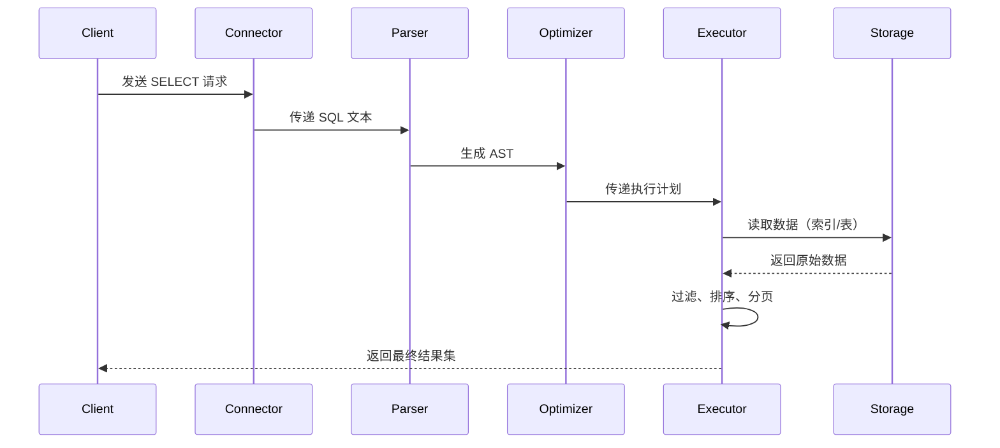

以下是 **SELECT 语句从传入数据库引擎到执行完毕的全流程详解**，涵盖从客户端请求到结果返回的每一个核心步骤。以典型关系型数据库（如 MySQL、PostgreSQL）为例：

---

### **一、客户端请求阶段**
1. **连接建立**  
   - 客户端通过协议（如 JDBC/ODBC）与数据库建立 TCP 连接。
   - 完成身份认证（用户名、密码校验）和权限检查（确认用户是否有权执行 SELECT 操作）。

2. **SQL 语句传输**  
   - 客户端将 SQL 语句（如 `SELECT * FROM users WHERE age > 25 ORDER BY name LIMIT 10;`）发送到数据库服务器。

---

### **二、数据库引擎内部处理阶段**
#### **1. 解析阶段（Parser）**
   - **词法分析**  
     将 SQL 文本拆分为 Token（关键字、表名、列名、运算符等）。  
     示例：`SELECT` → 关键字，`users` → 表名，`age` → 列名，`>` → 运算符。

   - **语法分析**  
     验证 SQL 是否符合语法规则（如 `WHERE` 后必须有条件表达式），生成**抽象语法树（AST）**。  
     *错误处理*：若语法错误（如缺少 `FROM`），返回错误信息。

   - **语义分析**  
     检查逻辑有效性：  
     - 表 `users` 是否存在？  
     - 列 `age` 和 `name` 是否存在于表中？  
     - 用户是否有权限访问这些表和列？

---

#### **2. 查询优化阶段（Optimizer）**
   - **逻辑优化**  
     重写查询以提升效率，例如：  
     - 消除冗余条件（如 `WHERE 1=1`）。  
     - 子查询展开或转换为 JOIN。  
     - 常量表达式预先计算（如 `WHERE age > 10+15` → `WHERE age > 25`）。

   - **物理优化**  
     生成候选执行计划，估算每个计划的代价（基于统计信息）：  
     - **统计信息**：表大小、索引基数、数据分布直方图。  
     - **代价模型**：计算 CPU、I/O、内存消耗。  
     - **关键决策**：  
       - 选择访问路径（全表扫描 vs 索引扫描）。  
       - 确定 JOIN 顺序和算法（Nested Loop Join、Hash Join、Merge Join）。  
       - 是否使用临时表存储中间结果。  

   - **选择最优执行计划**  
     根据代价模型选择总成本最低的计划。  
     *示例*：对 `WHERE age > 25`，若 `age` 列有索引且过滤率高，优先使用索引扫描。

---

#### **3. 执行计划生成（Execution Plan Generation）**
   - 将优化后的逻辑转换为**物理执行计划**（操作符树）：  
     ```sql
     -> Limit (取前10条)
         -> Sort (按 name 排序)
             -> Filter (age > 25)
                 -> Seq Scan on users (全表扫描)
     ```
     或（若使用索引）：  
     ```sql
     -> Limit
         -> Sort
             -> Index Scan using idx_age on users (索引扫描)
     ```

---

#### **4. 执行阶段（Execution Engine）**
   - **执行引擎**按计划树自底向上处理数据，采用**迭代器模型**（Volcano Model）：  
     - 每个操作符（如 Scan、Filter、Sort）实现 `Open()`、`Next()`、`Close()` 方法。  
     - 父节点调用子节点的 `Next()` 获取数据，逐级处理。

   - **关键步骤**：  
     1. **数据访问**：  
        - **全表扫描**：逐行读取数据页（可能利用缓冲池 Buffer Pool 缓存热数据）。  
        - **索引扫描**：通过 B+ 树定位符合条件的数据行（回表查询需根据主键获取完整行数据）。  

     2. **过滤（WHERE）**：  
        逐行检查 `age > 25` 条件，丢弃不满足条件的行。  

     3. **排序（ORDER BY）**：  
        - 若数据量小，使用内存排序（如快速排序）。  
        - 若数据量大，使用外部归并排序（将数据分块排序后合并）。  

     4. **分页（LIMIT）**：  
        仅保留前 10 条结果，提前终止后续数据处理。  

   - **锁与并发控制**：  
     - 根据隔离级别（如 Read Committed）决定是否加锁或使用 MVCC 多版本快照。  
     - 例如：MVCC 下读取事务开始时的数据快照，避免脏读。

---

#### **5. 结果返回**  
   - 将最终结果集序列化为客户端协议格式（如 MySQL 的二进制协议）。  
   - 通过 TCP 连接返回给客户端。  
   - 释放相关资源（如临时表、游标、锁）。

---

### **三、核心组件协作流程**


---

### **四、性能影响因素**
1. **索引设计**：索引命中率直接影响数据访问效率。
2. **统计信息准确性**：过时的统计信息会导致优化器选择次优计划。
3. **硬件资源**：磁盘 I/O 速度、内存大小（减少临时表落盘）。
4. **锁竞争**：高并发场景下锁等待会增加延迟。
5. **网络延迟**：大数据量结果集传输时间。

---

### **五、示例全流程分析**
**SQL**：`SELECT name FROM users WHERE age > 25 ORDER BY name LIMIT 10;`

6. **解析**：确认语法正确，`users` 表存在且有 `name` 和 `age` 列。
7. **优化**：统计显示 `age` 列 50% 数据 >25，优化器选择全表扫描 + 内存排序。
8. **执行**：
   - 全表扫描 `users`，过滤出 `age > 25` 的行。
   - 在内存中对结果按 `name` 排序。
   - 取前 10 条，返回给客户端。
9. **资源释放**：关闭表句柄，释放排序内存。

---

**总结**：SELECT 执行流程是数据库核心能力的综合体现，涉及解析、优化、执行三大阶段，每一步的设计（如索引、统计信息、执行算法）均直接影响查询性能。