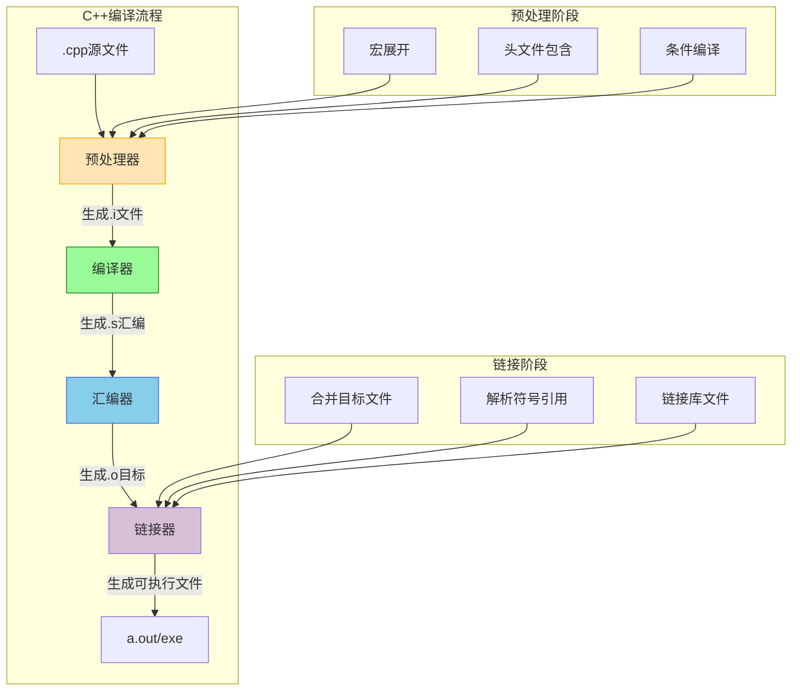

# 一.C++ vs Java 全方位对比手册
## 1.目录结构
1. [语言概览](#语言概览)
2. [历史背景](#历史背景)
3. [开发环境搭建](#开发环境搭建)
4. [创建过程对比](#创建过程对比)
5. [语法特性对比](#语法特性对比)
6. [内存管理机制](#内存管理机制)
7. [面向对象实现](#面向对象实现)
8. [标准库对比](#标准库对比)
9. [性能分析](#性能分析)
10. [应用场景](#应用场景)
11. [生态系统](#生态系统)
12. [未来趋势](#未来趋势)


## 2.语言概览


## 3.历史背景
**C++**
   • **起源**：由Bjarne Stroustrup于1979年在贝尔实验室开发，最初称为“C with Classes”，旨在扩展C语言以支持面向对象编程。  
   • **设计目标**：强调高性能、系统级编程，支持多范式（面向对象、泛型、过程式编程），允许直接操作内存和硬件资源。  
   • **核心特性**：手动内存管理、指针操作、运算符重载、模板元编程等。

**Java**
   • **起源**：由James Gosling于1995年在Sun Microsystems开发，目标是为嵌入式设备提供跨平台、安全、简洁的编程语言。  
   • **设计目标**：纯面向对象、跨平台性（“一次编写，到处运行”）、自动内存管理（垃圾回收）。  
   • **核心特性**：JVM（Java虚拟机）解释字节码、强类型检查、丰富的标准库（如集合框架、多线程支持）。

| 维度       | C++                                    | Java                              |
| -------- | -------------------------------------- | --------------------------------- |
| **诞生时间** | 1983年（Bjarne Stroustrup）               | 1995年（James Gosling）              |
| **开发目的** | 增强C的面向对象能力                             | "Write Once, Run Anywhere"        |
| **演变历程** | C with Classes → C++98 → C++11 → C++20 | Oak → Java 1.0 → Java 8 → Java 17 |


## 4.开发环境搭建
### 1.C++环境配置
```bash
# Ubuntu示例
sudo apt update
sudo apt install g++ build-essential

# 验证安装
g++ --version
```

### 2.Java环境配置
```bash
# 安装JDK
sudo apt install openjdk-17-jdk

# 环境变量设置
export JAVA_HOME=/usr/lib/jvm/java-17-openjdk-amd64
export PATH=$PATH:$JAVA_HOME/bin
```


## 5.编译流程对比



## 6.语法特性对比
### <1>核心差异表
| 特性                | C++                      | Java                     |
|---------------------|--------------------------|--------------------------|
| **编译方式**        | 完全编译为机器码         | 编译为字节码 + JIT       |
| **指针支持**        | 原生指针                 | 无指针，只有引用         |
| **多重继承**        | 支持                     | 仅接口多继承             |
| **运算符重载**      | 允许                     | 除String外禁止           |
| **预处理指令**      | 支持#define等            | 没有预处理               |
| **内存管理**        | 手动(new/delete)         | 自动GC                   |
| **泛型实现**        | 编译时模板实例化         | 类型擦除                 |
| **异常处理**        | 异常不可控               | checked异常机制          |

### <2>代码示例对比
#### 类定义
```cpp
// C++
class MyClass {
private:
    int data;
public:
    explicit MyClass(int d) : data(d) {}
    void show() { cout << data; }
};
```

```java
// Java
public class MyClass {
    private int data;
    
    public MyClass(int d) {
        this.data = d;
    }
    
    public void show() {
        System.out.println(data);
    }
}
```
#### 内存操作
```cpp
// C++动态内存
int* arr = new int[10];
delete[] arr;

// 智能指针
auto ptr = make_unique<MyClass>();
```

```java
// Java自动回收
int[] arr = new int[10];
// 无需手动释放
```


## 7.内存管理机制
### <1>C++内存模型


### <2>Java内存结构


## 8.面向对象实现
### 多态实现对比
| 维度        | C++虚函数表                   | Java方法表                     |
|-------------|-------------------------------|-------------------------------|
| **实现方式** | 每个类维护虚函数表           | 每个类有方法区中的方法表      |
| **调用开销** | 间接调用（指针跳转）         | 类似机制                      |
| **动态绑定** | 通过vptr实现                 | 默认所有方法虚调用            |
| **final**    | C++11引入final关键字          | 原生支持final类和final方法    |


## 9.标准库对比
### <1>C++ STL核心组件
```mindmap
- STL
  - Containers
    - Sequence
      - vector
      - list
      - deque
    - Associative
      - map
      - set
  - Algorithms
    - sort
    - find
  - Iterators
  - Function Objects
```

### <2>Java Collection框架


## 10.性能分析
### 基准测试对比（相对值）
| 测试项          | C++执行时间 | Java执行时间 |
|-----------------|------------|-------------|
| 数值计算        | 1.0x       | 1.2-1.5x    |
| 内存访问        | 1.0x       | 1.1-1.3x    |
| 对象创建        | 1.0x       | 2.0-3.0x    |
| 启动时间        | 0.1s       | 0.5-1.0s    |


## 11.应用场景
### <1>C++典型领域


### <2>Java主流应用


## 12.生态系统
### <1>C++工具链
```csv
分类,工具
编译器,GCC, Clang, MSVC
构建系统,Make, CMake, Bazel
测试框架,Google Test, Catch2
包管理,vcpkg, Conan
IDE,Visual Studio, CLion, Qt Creator
```

### <2>Java技术栈
```csv
领域,技术栈
Web框架,Spring Boot, Micronaut
微服务,Spring Cloud, Quarkus
数据库,Hibernate, MyBatis
构建工具,Maven, Gradle
容器化,Jib, Docker
```


## 13.未来趋势
| 方向        | C++发展                  | Java演进                  |
|-------------|--------------------------|--------------------------|
| **语言特性**| 模块化、概念约束         | Project Loom（虚拟线程） |
| **跨平台**  | 增强跨平台ABI支持        | GraalVM多语言支持        |
| **性能优化**| 并行算法库完善           | Vector API增强           |
| **生态扩展**| 机器学习库支持           | Jakarta EE规范更新       |


