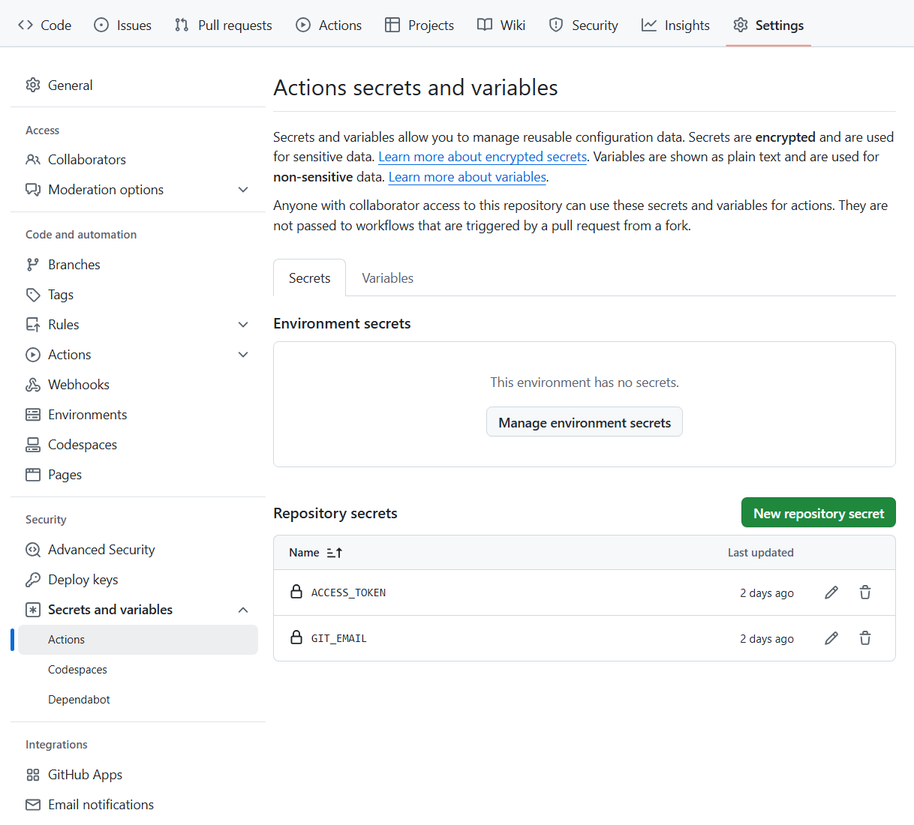

根据以下文章部署：
[OBSidian与HEXO的同步维护方案 | Kokutou's Blog](https://kokutou.top/posts/24083/index.html)
此文章已经能解决大部分问题，下面列举在部署过程中遇见的一些问题：
# Step 1 - Hexo安装
√

这些需要知道一下：

`public`目录下存放的是我们生成的「**静态页面**」；
`source/_posts`目录下存放的是我们写的「**文章**」；
`themes`目录下存放的是「**博客**」的主题；
`_config.yml`是「**博客全局配置**」文件；
`_config.landscape.yml`是「**博客主题配置**」文件；

---

# Step 2 - Git初始化配置
√

```bash
hexo clean && hexo g && hexo d && hexo s
##执行顺序：1.清理旧文件 → 2.生成新文件 → 3.部署到远程 → 4.启动本地预览
```

执行完上述命令后，进入这个网页，有Hexo的网页展示，即代表基本的GitHub+HEXO搭建成功
```text
用户名.github.io
```

可以继续跟着教程配置Next主题

---

# Step 3 - 仓库双分支配置
## 1.对master分支和hexo分支的说明
在上面步骤中，Hexo 根目录的 `_config.yml` 中设置了部署分支为 `master`：
```yaml
deploy:
  type: git
  repo: https://github.com/username/username.github.io.git  # 用户站点仓库地址
  branch: master  # 指定推送的分支
```

对于本​**用户站点仓库（`<username>.github.io`）​**来说：
- **分支用途**：
**`master` 分支**：存放 Hexo 生成的静态网页文件（`public/` 目录内容）。
**`hexo` 分支**：存放网页的源码内容（包含框架、后续的笔记等等）。
- **部署原理**：
GitHub 自动将 `master`/`main` 分支作为网站根目录，访问 `https://<username>.github.io` 时会直接渲染该分支下的内容。
​

## 2.GitHub提交不稳定
向GitHub进行git push，会很不稳定，一直试有时候20分钟才能成功，要预先优化GitHub的提交。


## 3.自动化更新网页
原文中：
```text
"之后自动化任务中的`git push --force --quiet "https://$GH_TOKEN@$REPO" master:master`能让生成的文件覆盖`master`分支中的文件，这样`master`分支中便是我们需要的`public`内的文件了"
```
这是下面GitHub Actions要做的事。

GitHub Actions 是 ​**GitHub 官方提供的自动化工作流工具**，允许开发者直接在 GitHub 仓库中定义、执行和管理自动化任务（如测试、构建、部署等）。其核心逻辑是通过事件触发（如代码推送、Pull Request、Issue 创建等）来自动执行自定义的工作流程。

下面GitHub Actions主要实现的功能是：在hexo分支git push源码后，自动执行hexo那一套流程，做到提交代码之后自动生成最新网页，不必手动执行生成网页操作。

---

# Step 4 - Obisidian 以及 Obisidian Git插件
## 1.Obisidian插件
不用魔法的话，进不去插件商城。本人使用pkmer


## 2.设置模板
倘若创建了Front-matter，但是插入模板的时候找不到。这是因为文件没有后缀，导致项目里没有识别Front-matter文件。改成Front-matter.md即可，工程中也能找到了。

---

# Step 5 - 配置GitHub Actions自动部署
## 1.创建`GIT_EMAIL`和`ACCESS_TOKEN`
按照流程创建GIT_EMAIL与ACCESS_TOKEN。

原文中：
```text
点击生成，生成完成之后，以同样的方式`new Secret`即可完成流水线的配置~
```
指的是下图：**打开目标仓库 → 点击顶部 ​Settings → Secrets → Actions → New repository secret**




## 2.部署失败解决方法
```text
请自行进入失败的任务项目，浏览部署日志，查找问题所在！！！
请自行进入失败的任务项目，浏览部署日志，查找问题所在！！！
请自行进入失败的任务项目，浏览部署日志，查找问题所在！！！
```
正如上述内容，没成功的话在GitHub的Actions下会是×的状态，点进去即可看到日志，列举一下我遇见的问题与解决方法：
### （1）Error: Cannot find module 'css'
缺少css的资源，在依赖处，添加安装 css 组件的命令：
```shell
##在根目录下
vim .github/workflows/deployment.yml 

在此文件的：- name: Install dependencies & Generate static files
下面添加命令：npm install css --save
```

### （2）fatal: could not read Password for 'https://github.com': No such device or address \ Error: Process completed with exit code 128.
由于ACCESS_TOKEN没配置好导致的，按上面配置好ACCESS_TOKEN即可连通。

### （3）ERROR Plugin load failed: hexo-renderer-marked
虽然这是一个报错，但是流程Install dependencies & Generate static files并未报错：
外面看：

内部报错：


这会导致网页无法加载，最终看了一下内部的部署日志才看到，原因是hexo-renderer-marked的版本问题。所以**部署日志还是非常重要的**。解决方法同Error: Cannot find module 'css'，安装正确的hexo-renderer-marked版本即可，至于哪个版本正确，我也是在网上搜的，4.0就没问题。
```shell
##在根目录下
vim .github/workflows/deployment.yml 

在此文件的：- name: Install dependencies & Generate static files
下面添加命令：npm install hexo-renderer-marked@4.0.0 --save
```

### （4）Error: Spawn failed
在使用Watt Toolkit对GitHub进行加速的时候，git push好使，但是hexo d不好使，报错生成失败。关闭Watt Toolkit的加速即可。

### （5）Error: ENOENT: no such file or directory
```text
'/home/runner/work/num1chenziyang.github.io/num1chenziyang.github.io/node_modules/highlight.js/styles/tomorrow-night.css'
```
因为**highlight.js 版本**：新的版本可能移除了 `tomorrow-night.css` 或修改了文件名。

安装旧版本的**highlight.js**后又报错：
```text
Verion 9 of Highlight.js has reached EOL. It will no longer be supported or receive security updates in the future. Please upgrade to version 10 or encourage your indirect dependencies to do so.
```

最终通过升级 Hexo 核心和插件自动解决了依赖问题：
```bash
# 升级 Hexo 主程序
npm install hexo@latest --save

# 升级所有插件（如渲染器、部署工具等）
npm update --save

# 如果存在锁定文件冲突，删除后重装
rm -rf package-lock.json node_modules
npm install
```

### （6）ERROR Script load failed:函数问题
```text
ERROR Script load failed:themes/hexo-theme-next/scripts/events/lib/vendors.js 

Error: Function yaml.safeLoad is removed in js-yaml 4. Use yaml.load instead, which is now safe by default.
```
Hexo Next主题脚本中使用的`js-yaml`版本与当前环境不兼容。从报错信息可知：
- `js-yaml` 4.0+版本移除了`safeLoad`方法
- 当前主题代码仍在使用旧版API，导致加载YAML配置文件失败

解决方法：
```diff
- const data = yaml.safeLoad(......);
+ const data = yaml.load(......);  // 替换为yaml.load
```

### （7）ERROR Script load failed:语法问题
```text
if (config.algolia && theme.algolia_search?.enable) { 
                           ^ 
SyntaxError: Unexpected token '.' 
at new Script (vm.js:88:7) 
at createScript (vm.js:261:10) 
at runInThisContext (vm.js:309:10)
......
```
Next主题版本太高了，要求的Node.js版本高。
这里我是降级了Next版本，使用v8.0.0版本。

### note:
一些体会：
```text
1.搭建过程中会遇见很多问题，这是正常的，问AI可以解决大部分问题。很多问题都是HEXO、NEXT、各种组件的版本不适配导致的。
2.中途换了一个别的版本的NEXT，导致大量的错误。由此可见不要乱升级，否则会导致各种各样的冲突，非常麻烦。
3.当完全弄乱了的时候，用git切回之前的提交，能救回来。
4.要做好备份，最好在里程碑的地方把目录备份一下，以防救不回来项目直接寄了的情况发生（一般来说不会）。
5.先执行：hexo clean && hexo generate && hexo server，在本地查看没问题了再往GitHub上提交。
```

待调研和解决的问题：
```text
1.obsidian的主题能不能在NEXT上实现？
2.对GitHub Actions工作流程的详细解释。
3.mac与win如何一块使用obsidian？
4.OneNote迁移到obsidian的改造。
```