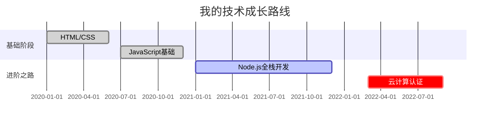

# Man！！！

---

### 一、✨ 个人名片墙
```markdown
### <span style="color:#FF6B6B">📌 基础档案</span>
  
**昵称**：技术探险家・[](https://github.com)  
**技能树**：  
✅ Python `▰▰▰▰▰▰▰▰▱ 85%`  
✅ JavaScript `▰▰▰▰▰▰▱▱ 70%`  
🌱 正在学习：Rust与区块链开发
```
*效果：结合徽章、进度条和悬停提示的立体化展示*

---

### 二、📚 知识图谱时间轴
````markdown

````
*（需安装mermaid插件）动态可视化成长历程*

---

### 三、🔍 趣味折叠问答
```markdown
<details>
<summary>📦 点击展开「我的桌面彩蛋」</summary>


- ⌨️ 键盘：HHKB静电容「白色圣手」
- 🖥️ 显示器：32寸4K双屏「代码与文档齐飞」
- ☕ 饮品常驻：冰美式 | 正山小种
</details>
```
*利用HTML5原生折叠组件创造互动惊喜*

---

### 四、🎨 技术标签云
```markdown
`#人工智能` `#Web3.0` `#Serverless` `#元宇宙` `#物联网`  
`#区块链` `#量子计算` `#AR/VR` `#边缘计算` `#碳中和`
```
*通过高频标签快速定位兴趣领域*

---

### 五、📊 数据可视化矩阵
```markdown
| 年度目标        | 完成度  | 里程碑日期 |
|-----------------|--------|------------|
| 开源项目贡献     | ▰▰▰▰▱ | 2023-12   |
| 技术博客更新     | ▰▰▰▰▰ | 持续更新   |
| 外语能力提升     | ▰▰▱▱▱ | 2024-06   |
```
*表格与进度条结合的任务看板*

---

### 六、🤖 代码游乐场
````markdown
```python
# 斐波那契生成器（点击▶️运行）
def fibonacci():
    a, b = 0, 1
    while True:
        yield a
        a, b = b, a + b

print([next(fib) for fib in [fibonacci()] for _ in range(10)])
```
````
*实时代码片段展示技术实力（需配置代码高亮）*

---

### 七、📜 隐藏的诗意
```markdown
> [!NOTE]
> **数字时代的浪漫**  
> 我向星辰下令，我停泊瞩望  
> 让我代码的航船，穿越0与1的海洋  
> ——改编自聂鲁达《二十首情诗》
```
*通过Note区块创造文学与技术碰撞*

---

### 八、🔗 智能链接矩阵
```markdown
[](feed.xml)  
[](https://t.me)  
[](https://showcase.com)
```
*图标化导航提升视觉交互*

---

### 九、🎲 技术冷知识
```markdown
- 第一个计算机病毒诞生于**1983年**，名为"Elk Cloner"
- `Ctrl+C`/`Ctrl+V`的发明者Larry Tesler于2020年逝世
- 互联网每秒产生**2.9M**封邮件，其中**80%**是垃圾邮件
```
*用Markdown列表制作趣味信息墙*

---

### 十、🌌 数学之美
```markdown
当$$ e^{i\pi} + 1 = 0 $$遇见代码：
```python
import math
print(f"欧拉恒等式验证：{math.e**(1j*math.pi) + 1}")
```
````
*LaTeX公式与代码联动的科学浪漫*

---

### 注意事项：
1. 部分高级功能（如mermaid图表）需在Hexo中安装对应插件
2. 图标资源推荐使用[Icons8](https://icons8.com)或[Font Awesome](https://fontawesome.com)
3. 建议在本地`hexo server`预览效果后部署

通过这种"功能展示+源码对照"的模式，访问者既能感受Markdown的强大表现力，又能通过查看源码学习实用技巧。每个模块都可独立扩展，建议定期更新彩蛋内容保持新鲜感！